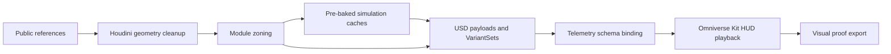

# Case 02 Pipeline Diagram

This diagram is a lightweight proof layer for the Case 02 pipeline. It shows the
intended production flow without claiming live physics, proprietary geometry, or
certification-grade CFD.
